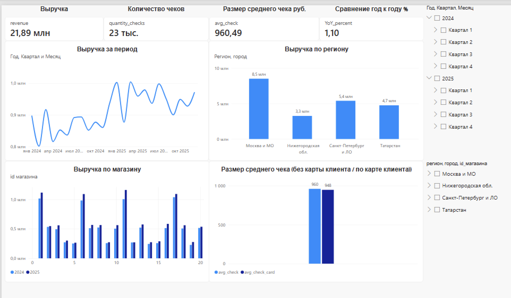

# 📊 Аналитический дашборд для сети магазинов «Соседушка»

> **Power BI • DAX • Power Query • Retail Analytics**

##  О проекте
Интерактивный аналитический отчет для сети продуктовых магазинов «Соседушка». Дашборд отвечает на ключевые вопросы бизнеса: мониторинг выручки, оценка эффективности регионов и магазинов, а также анализ влияния программы лояльности на средний чек.

## 🎯 Бизнес-задача
- **Где мы растем, а где проседаем?** (динамика выручки по регионам и YoY)
- **Какие магазины тянут сеть вниз?** (рейтинг магазинов)
- **Работает ли программа лояльности?** (сравнение среднего чека с картой и без)
- **Как проявляется сезонность?** (пики и провалы продаж по месяцам)

## 📊 Источники данных
| Параметр | Значение |
|----------|----------|
| **Объем** | 81 238 строк в таблице фактов |
| **Период** | 01.01.2024 — 31.12.2025 (24 месяца) |
| **География** | 4 региона (Москва и МО, СПб и ЛО, Нижегородская обл., Татарстан) |
| **Магазины** | 20 магазинов разных форматов |
| **Структура** | Звёздная схема: 1 факт + 4 справочника |

## 🛠 Техническая реализация
- **Power Query:** Загрузка данных из Excel, очистка «грязного» листа, приведение типов данных.
- **Модель данных:** Звёздная схема (Star Schema) со связями «один-ко-многим».
- **DAX:** Написаны меры для расчета `revenue`, `avg_check`, `YoY_percent`, а также сегментации чеков по наличию карты лояльности (`avg_check_card`).
- **Таблица дат:** Создана через DAX (`dim_calendar`) для корректной работы time-intelligence функций.

## 📈 Ключевые инсайты (Выводы)
1. Общая динамика: сеть растёт
Выручка 2025 года: 11,46 млн руб.
Рост год к году (YoY): +10% (коэффициент 1,10)
Количество чеков: ~12 тыс. в 2025 году
Средний чек по сети: 973 руб.
Вывод: Сеть демонстрирует устойчивый рост. Рост обеспечен как увеличением числа чеков, так и повышением среднего чека.

2. 🗺 Региональный анализ: Москва лидер, Нижний отстаёт
Ключевые инсайты:
🏆 Москва — безусловный лидер: 38% выручки при максимальном среднем чеке (~1 050 ₽)
⚠️ Нижегородская область — аутсайдер: средний чек на 30% ниже, чем в Москве (735 ₽ vs 1 050 ₽). Это сигнал для анализа ассортимента, ценообразования или покупательской способности в регионе
Татарстан показывает неожиданно высокий средний чек (~1 049 ₽), почти на уровне Москвы — возможно, там сосредоточены магазины премиум-формата

3. 💳 Программа лояльности: нейтральный эффект
Неожиданный вывод: Вопреки распространённому мнению, держатели карт лояльности не тратят значимо больше обычных покупателей. Разница всего 7 рублей (<1%) — статистически несущественна.
Возможные причины:
Карта даёт скидку, но не стимулирует доп. покупки
Держатели карт — частые, но «экономные» покупатели
Механика программы не настроена на увеличение среднего чека (нет персонализированных предложений, накопительных бонусов за объём)
Рекомендация: Пересмотреть механику программы лояльности — добавить персональные предложения, бонусы за достижение порога трат, кросс-продажи.

4. 📅 Сезонность: чёткие пики и провалы
Провалы (спад продаж):
❄️ Январь–февраль — классический «праздничный откат» после Нового года
🍂 Октябрь — межсезонье, снижение покупательской активности
Пики (рост продаж):
Апрель–май — весенний рост
☀️ Июль — летний сезон
🎄 Декабрь — новогодний ажиотаж (выручка в 1,5–2 раза выше среднего)
Рекомендация: Запускать промо-акции и маркетинговые кампании в периоды провалов (январь, февраль, октябрь) для сглаживания сезонных колебаний.

5. 🏪 Рейтинг магазинов: разрыв 4–5 раз
Топ-3 магазина (лидеры):
Магазин №11 (Санкт-Петербург) — ~1,1 млн руб.
Магазин №6 (Москва) — ~1,0 млн руб.
🥉 Магазин №1 (Москва) — ~1,0 млн руб.
Аутсайдеры:
Магазин №4, №5 (Москва) — ~0,25–0,3 млн руб.
Магазин №19 (Татарстан) — ~0,25 млн руб.
Вывод: Разрыв между лучшим и худшим магазином достигает 4–5 раз. Это указывает на неравномерность развития сети.
Рекомендация: Изучить практики топ-магазинов (ассортимент, расположение, мерчандайзинг) и тиражировать их на аутсайдеров. Рассмотреть вопрос закрытия или ребрендинга хронически убыточных точек.

🎯 Итоговые рекомендации для бизнеса
Инвестировать в Нижегородскую область — провести аудит ассортимента и ценообразования, средний чек критически низок
Перезапустить программу лояльности — текущая механика не увеличивает средний чек; добавить персонализацию и накопительные бонусы
Сглаживать сезонность — запускать промо в январе, феврале и октябре
Тиражировать лучшие практики — изучить успех магазинов №1, №6, №11 и применить в аутсайдерах
Развивать канал СБП — растущий сегмент с низкой комиссией
Мониторить YoY по регионам — Москва даёт 38% выручки, но диверсификация снижает риски
📌 Главный инсайт проекта
Сеть растёт на 10% в год, но рост неравномерен. Москва и Татарстан показывают высокие средние чеки (~1 050 ₽), тогда как Нижегородская область отстаёт на 30%. Программа лояльности в текущем виде не работает на увеличение среднего чека — держатели карт тратят столько же, сколько обычные покупатели. 

##  Как воспроизвести
1. Скачайте репозиторий.
2. Откройте файл `report/Sosnedushka_Dashboard.pbix` в Power BI Desktop.
3. В Power Query укажите актуальный путь к файлу `data/Соседушка_данные (1).xlsx`.
4. Нажмите **Refresh** (Обновить).

---
*Кейс выполнен в рамках обучения аналитике данных. Инструменты: Power BI, DAX, Power Query.*
